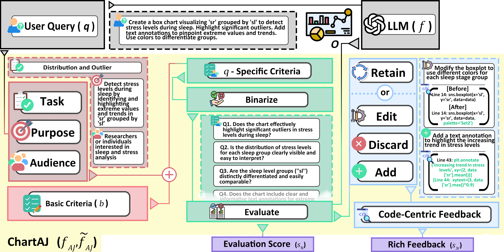

# ChartAJ and ChartUIE-8K: Rich AI Feedback for Chart Generation

## Contents 
- [Project Site](#project-site)
- [Requirements](#requirements)
- [ChartAJ](#chartaj)
- [ChartUIE-8K](#chartuie-8k)

## Project Site

Qualitative demonstration of the pre- and post-feedback of ChartAJ is provided in [our project site](https://chartaj.github.io/).

## Requirements

This project requires several Python packages to be installed. The dependencies are listed in the `requirements.txt` file. Follow the instructions below to set up the environment:

### Installation Instructions

1. **Clone the Repository**:

   ```bash
   git clone https://github.com/chartaj/ChartAJ-and-ChartUIE-8K.git
   cd ChartAJ-and-ChartUIE-8K

2. **Install Dependencies**:

    Use pip to install the required packages listed in the requirements.txt file:

    ```bash
    pip install -r requirements.txt

3. **Updating Dependencies**:

    To update the dependencies in `requirements.txt`, you can manually add or modify the package versions. Alternatively, you can use the following command to generate an updated list based on your currently installed packages:

    ```bash
    pip freeze > requirements.txt
    ```

4. **API KEY**:

    You can choose to run the LLMs on your own devices or use APIs. We use the following API providers: `OpenAI` for GPT-4o, `Anthropic` for Claude 3.5 Sonnet,`Groq` for Llama 3.1 70B, and `Deepinfra` for Gemma 2 27B. Set api keys of the API providers in first cell of the `main.ipynb` file.
    ```bash
    OPENAI_API_KEY = "<INSERT API KEY>"
    ANTHROPIC_API_KEY = "<INSERT API KEY>"
    GROQ_API_KEY = "<INSERT API KEY>"
    DEEPINFRA_API_KEY = "<INSERT API KEY>"
    ```


## ChartAJ
ChartAJ is a reasoning framework for automatic chart generation evaluation and rich feedback. We use GPT 4o and Claude 3.5 Sonnet as the base models for ChartAJ. The code for ChartAJ is in `autojudge.py`, and the overall workflow can be run in the `main.ipynb` file.



### Module 1
Module 1 is responsible for domain grounding, leveraging insights from the extensive chart literature in prominent venues. Three essential factors (1) Task, (2) Purpose, and (3) Audience are decomposed from the user query through `prompts/AJ_SD.txt`. Then, it is fused with the Basic Criteria (general, high-level criteria for chart evaluation) assigned to `basic_criteria` variable in `autojudge.py`, establishing <i>q-specific criteria</i>-specializing the general Basic Criteria with `prompts/AJ_criteria_establishment.txt` prompt.

### Module 2
Module 2 is in charge of binarizing the <i>q-specific criteria</i> into Yes or No questions and evaluating the questions. The prompt for binarization is provided in `prompts/AJ_create_eval_q.txt`, and the prompt for evaluation is in `prompts/AJ_execute_eval.txt`.

### Module 3
Module 3 makes each evaluation QA set to be categorized into four actions—RETAIN, EDIT, ADD, or DISCARD. These evaluations are then converted into actionable code feedback. We provide the prompt `prompts/AJ_generate_feedback.txt` for generating code centric feedback.

## ChartUIE-8K

The ChartUIE-8K (Chart User Interaction Emulation) evaluation set can be found in the `ChartUIE_8K/UIE_evaluation_set` directory. Every file in the set follows the naming convention `uie_sample_{idx}_{word_count}_{sub_idx}.yaml`, where `idx` refers to the sample index, `word_count` indicates the number of words (either 50 or 100), and `sub_idx` is an additional index for multiple variations of each `idx` sample. The underlying data sets corresponding to each query is located in the `ChartUIE_8K/data` directory. It includes .csv and .json files. The range of different chart types and topics used are mentioned in `chart_topics.yaml` and `chart_types.yaml` files. The license for each data is documented in `{idx}_info.yaml` for each data index. This repository was made under non-profit academic use. Users of this repository should consider the license documented in `{idx}_info.yaml`.
<!-- 
## ChartAgent

ChartAgent is responsible for handling data-to-chart (d2c) generation tasks. We utilized two closed-source models (GPT-4o and Claude 3.5 Sonnet) and two open-source models (Llama 3.1 70B and Gemma 2 27B). The code for ChartAgent is in `ChartAgent.py`.

ChartAgent performs two d2c tasks in the workflow. The first task is the initial d2c generation, where it creates chart code based on the user’s query (including initial instructions and further instructions in a Q&A format). The second task is the post-feedback d2c generation, which incorporates feedback from ChartAJ. -->
