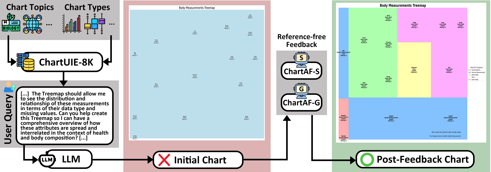

# [NAACL 2025 Oral] C²: Scalable Auto-Feedback for LLM-based Chart Generation



## Updates
[2025.03.08] C² is accepted as an Oral Presentation in NAACL 2025

## Contents 
- [Project Site](#project-site)
- [Requirements](#requirements)
- [ChartAF](#chartaf)
- [ChartUIE-8K](#chartuie-8k)
- [ChartAF In-context Tuning Process Example](#chartaf-in-context-tuning-process-example)

## Project Site

Qualitative demonstration of the pre- and post-feedback of ChartAF is provided in [our project site](https://chartsquared.github.io/).

## Requirements

This project requires several Python packages to be installed. The dependencies are listed in the `requirements.txt` file. Follow the instructions below to set up the environment:

### Installation Instructions

1. **Clone the Repository**:

   ```bash
   git clone https://github.com/chartsquared/C-2.git
   cd C-2

2. **Install Dependencies**:

    Use pip to install the required packages listed in the requirements.txt file:

    ```bash
    pip install -r requirements.txt

3. **Updating Dependencies**:

    To update the dependencies in `requirements.txt`, you can manually add or modify the package versions. Alternatively, you can use the following command to generate an updated list based on your currently installed packages:

    ```bash
    pip freeze > requirements.txt
    ```

4. **API KEY**:

    You can choose to run LLMs on your own devices or use APIs. We use the following API providers: `OpenAI` for GPT-4o, `Anthropic` for Claude 3.5 Sonnet,`Groq` for Llama 3.1 70B, and `Deepinfra` for Gemma 2 27B. Set api keys of the API providers in first cell of the `src/main.ipynb` file.
    ```bash
    OPENAI_API_KEY = "<INSERT API KEY>"
    ANTHROPIC_API_KEY = "<INSERT API KEY>"
    GROQ_API_KEY = "<INSERT API KEY>"
    DEEPINFRA_API_KEY = "<INSERT API KEY>"
    ```


## ChartAF
The core logic for ChartAF resides in the `src/autofeedback.py`, while the overall workflow can be executed via `src/main.ipynb` file. The `src/feedbacks` directory stores the visual and code feedback generated by ChartAF, and the `src/plots_d2c` directory contains chart images both before and after feedback. These outputs are generated as part of the workflow, showcasing how feedback is processed and the corresponding charts are updated accordingly.


### Module 1
- `src/prompts/AF_TPA.txt`
- `src/prompts/AF_criteria_establishment.txt`

### Module 2
- `src/prompts/AF_create_eval_q.txt`
- `src/prompts/AF_execute_eval.txt`.

### Module 3
- `src/prompts/AF_generate_feedback.txt`

## ChartUIE-8K

The ChartUIE-8K (Chart User Interaction Emulation) evaluation set can be found in the `ChartUIE_8K/UIE_evaluation_set` directory. Every file in the set follows the naming convention `uie_sample_{IDX}_{WORD_COUNT}_{SUB_IDX}.yaml`, where `IDX` refers to the sample index, `WORD_COUNT` indicates the number of words (either 50 or 100), and `SUB_IDX` is an additional index for multiple variations of each `IDX` sample. The underlying data sets corresponding to each query is located in the `ChartUIE_8K/data` directory. It includes .csv and .json files. The license for each data is documented in `{IDX}_info.yaml` for each data index. This repository was made under non-profit academic use. Users of this repository should consider the license documented in `ChartUIE_8K/data/{IDX}_info.yaml`. The range of different chart types and topics used are mentioned in `ChartUIE_8K/chart_topics.yaml` and `ChartUIE_8K/chart_types.yaml` files. Sanity check failure cases, as mentioned in the paper are documented in `ChartUIE_8K/UIE_human_study_sanity_check_fails.csv`.


## ChartAF In-context Tuning Process Example

Throughout the `src/main.ipynb` workflow, a complete end-to-end example is generated and stored in the `src/memory.json` file at the final stage of execution. Below is a summary of example requests and responses for each module in ChartAF.

### Module 1: 

- Decomposition of Query into Task, Purpose, and Task

    REQUEST
    ```
        "You are a data visualization expert.
        Given the data and user request, your task is to analyze the user request to (1) select the most suitable task that the user is expecting from the list of various tasks in data visualization, (2) specifically figure out the purpose of the user's request in data visualization, and (3) prospective audience of the data visualization.
        
        Create a bar chart visualizing average N, P, K values for different crops. Highlight the 'rice' values with distinct colors. Include text annotations for crops 'rice' and 'wheat,' displaying their average N, P, K values. This helps compare nutrient needs of various crops effectively.
        
        ...

        Please reply in the same format without altering the key value.
        {'Task': None, 'Purpose': None, 'Audience': None}
        ...
        "
    ```

    RESPONSE
    ```
            "{"Task": "Comparison By Factor", "Purpose": "To visualize and compare the average N, P, K values for different crops, with a special focus on rice and wheat. This visualization aims to effectively illustrate the nutrient requirements of various crops, highlighting the differences between them.",  "Audience": "Agricultural researchers, farmers, and agronomists who are interested in understanding and comparing the nutrient needs of different crops, particularly rice and wheat."}"
    ```

- Query Specific Criteria Establishment with Basic Criteria

    REQUEST
    ```
        "You are a data visualization expert.
        You are given basic essential requirements of chart, user instruction, user request with QA, tasks that must be covered by the chart, purpose of the chart, and prospective audience of the chart.
        Your task is to develop a personalized, detailed, and objective list of criteria, building on the basic criteria, to evaluate a data visualization (chart).
        These criteria should be based on the user instruction, the user request through questions and answers, tasks at hand, intended purpose, and the prospective audience.
        
        Chart Type
            - Choose a chart type that aligns with the given purpose, task, and audience. The chart type should effectively convey the intended ...
        Visual Embellishment
            - Use embellishments to enhance understanding without overwhelming the data. Visual embellishments, like icons, patterns, or textures ...    å
        Text
            - Prioritize legibility and adhere to consistent textual criteria. Text elements, such as legends, titles, and labels, should be legible and easy to read, with sufficient contrast against the background. Consistent font size, style, and placement should be maintained to create a cohesive
        ...
    ```

    RESPONSE
    ```
        "To ensure a high-quality data visualization that effectively meets the specified requirements and serves the intended purpose, a comprehensive set of criteria must be developed. These criteria should focus on the essential chart components, considering user instructions, user requests, tasks, purpose, and the target audience. Here's a detailed and objective list of criteria for evaluating the given data visualization:
        1. **Chart Type Selection**
            - Ensure the use of a vertical bar chart to support direct comparison of average N, P, and K values across different crops.
            - Provide clear demarcation to highlight the nutrient values for each crop distinctly.
        2. **Visual Embellishment**
            - Apply subtle embellishments such as patterns or icons to make individual crop bars memorable and distinguishable, especially for the highlighted 'rice' values.
            - Avoid excessive embellishments that may distract or obscure the data.
        3. **Text and Annotations**
           - Ensure text annotations for 'rice' and 'wheat' are legible, displaying the exact N, P, K values clearly.\n   - Use a consistent font size and style throughout the chart to maintain cohesiveness.
           ..."
    ```

### Module 2: 

- Binarization of query-Specific Criteria into Yes/No Questions

    REQUEST
    ```
        "You are an expert critic.
        You will be given wanted tasks, intended purpose, prospective audience, and established criteria for the chart that you gave in the previous prompt.
        Your task is to create a list of Yes/No questions that checks if the generated chart satisfies the established criteria.
        Use the established criteria as a reference, but avoid applying them directly when crafting questions to evaluate the chart.
        
        <start of task>
        Comparison By Factor
        <end of task>
        
        <start of purpose>
        To effectively compare the nutrient needs of various crops by visualizing their average N, P, K values using a bar chart
        <end of purpose>
        
        <start of prospective audience>
        Agricultural researchers, farmers, and agronomists
        <end of prospective audience>
        
        <start of established criteria>
        To ensure a high-quality data visualization that effectively meets the specified requirements and serves the intended purpose, a comprehensive set of criteria must be developed. These criteria should focus on the essential chart components, considering user instructions, user requests, tasks, purpose, and the target audience. Here's a detailed and objective list of criteria for evaluating the given data visualization:\
        1. **Chart Type Selection**
            - Ensure the use of a vertical bar chart to support direct comparison of average N, P, and K values across different crops.
            - Provide clear demarcation to highlight the nutrient values for each crop distinctly.
        2. **Visual Embellishment**
            - Apply subtle embellishments such as patterns or icons to make individual crop bars memorable and distinguishable, especially for the highlighted 'rice' values.
            - Avoid excessive embellishments that may distract or obscure the data.
        3. **Text and Annotations**
            - Ensure text annotations for 'rice' and 'wheat' are legible, displaying the exact N, P, K values clearly.
        ...
        <end of established criteria>
        
        "Yes" should be treated as satisfaction, while "No" should be a dissatisfaction.
        Here is a detailed protocol for making questions:
        First, create questions according to the criteria, tasks, purpose, and audience. Extra questions that the criteria do not cover can be generated, yet it must help judge evaluating the chart.\nLastly, summarize similar questions and rank the questions so that the first question is the most important and the last question is the least important.
        
        Your output should follow the format below:
        Question 1 : [Question]
        Question 2 : [Question]
        ..."
    ```

    RESPONSE
    ```
        "Here is a list of Yes/No questions designed to evaluate whether the generated chart satisfies the established criteria:
        
        Question 1: Does the chart employ a vertical bar chart format to allow a direct comparison of N, P, and K values across different crops?
        Question 2: Are the colors used for highlighting 'rice' and 'wheat' distinct and easily distinguishable from other crops?
        Question 3: Is there a legend present that clearly explains the color coding used in the chart?
        Question 4: Are text annotations for 'rice' and 'wheat' clearly visible and placed near their respective bars without obstructing data interpretation?
        ...
    ```

- Evaluation of generated charts by answering Yes/No questions

    REQUEST
    ```
            "You are an expert evaluator (judge, critic) of the attached data visualization image.

            nHere is a list of Yes/No questions designed to evaluate whether the generated chart satisfies the established criteria:
            
            Question 1: Does the chart employ a vertical bar chart format to allow a direct comparison of N, P, and K values across different crops?
            Question 2: Are the colors used for highlighting 'rice' and 'wheat' distinct and easily distinguishable from other crops?
            Question 3: Is there a legend present that clearly explains the color coding used in the chart?
            ...
            The evaluation questions consist of YES/NO questions; the answer for each question MUST be either YES or NO. Don't give anything else like N/A.
            With the answers, you need to give feedback.
            When answering the questions, follow the step-by-step protocol below:

            1. Determine and tag whether the question is subjective or fact-checking:
                - Fact-checking: Verify if the chart image meets the criteria directly based on the visual content. If the image shows any deviation from the criteria, answer NO. If the image meets the criteria, answer YES.
                - Subjective: Consider whether the image meets the criteria based on visual appeal, clarity, and other subjective measures. Provide reasons for both YES and NO answers. If there is clear evidence to support a YES, and no substantial reasons to support a NO, answer YES. Answer NO otherwise.

            2. Answer the questions and provide feedback:
            After answering each question, provide feedback explaining your evaluation.
            List potential improvements categorized as RETAIN, DISCARD, EDIT, or ADD if necessary.

            Feedback Classification:
                RETAIN: Identify and specify any elements that should be retained even after the improvement.  
                DISCARD: Identify and specify any elements that should be discarded for better visualization.  
                EDIT: Specify edits needed in the image to satisfy the user's request. Provide examples if applicable.
                ADD: Identify and specify elements that should be added for better visualization of the user's initial prompt.

            To help your task, here is the user's initial prompt.\n\n<start of initial prompt>\nCreate a bar chart visualizing average N, P, K values for different crops. Highlight the 'rice' values with distinct colors. Include text annotations for crops 'rice' and 'wheat,' displaying their average N, P, K values. This helps compare nutrient needs of various crops effectively.\n<end of initial prompt>\n\nProvide the answers and feedback in JSON format. Do not output anything else.\nIf the provided image is just white and blank, give NO as answer for all the questions in the json format below.

            '''json
            {"evaluation":[
                {
                    "Q1": <Evaluation Question 1>,            
                    "A1": <YES or NO>,           
                    "Q_type": <Subjective or Fact-checking>,        
                    "feedback": [
                        {"tag": <RETAIN / DISCARD / EDIT / ADD>,
                        "improvement": <Modification (DISCARD / EDIT / ADD) or Elements to retain (RETAIN) for better visualization>
                        },
                        {"tag": <RETAIN / DISCARD / EDIT / ADD>,
                        "improvement\": <Modification (DISCARD / EDIT / ADD) or Elements to retain (RETAIN) for better visualization>
                        },
                        ...
                    ]
                },
                ...
                ]
            }
            '''
    ```

    RESPONSE
    ```
        '''json
            {"evaluation":[
                {
                    "Q1": "Does the chart employ a vertical bar chart format to allow a direct comparison of N, P, and K values across different crops?",
                    "A1": "NO",
                    "Q_type": "Fact-checking",
                    "feedback": [
                        {"tag": "EDIT",
                        "improvement": "Change the format to a vertical bar chart for easier comparison across crops.",
                        },
                        ...
                    ]
                },
                ...
                ]
            }
        '''
    ```
### Module 3: 

- Association to actionable code-centric feedback

    REQUEST
    ```
    "You are an expert software engineer on the Quality Assurance team.
    Your task is to provide feedback on the code based on the critic's feedback on the result of the code.\nThe code's goal is to successfully draw a chart, fulfilling the user's needs.
    You will be given the user's needs, the original code, the critic's feedback, the data attributes, and the resulting image of the code.
    
    Here is the user's needs.
    <start of needs>
    Create a bar chart visualizing average N, P, K values for different crops. Highlight the 'rice' values with distinct colors. Include text annotations for crops 'rice' and 'wheat,' displaying their average N, P, K values. This helps compare nutrient needs of various crops effectively.
    <end of needs>
    
    Here is the original code.
    
    <start of the code>
    import pandas as pd
    import matplotlib.pyplot as plt
    import os
    import numpy as np
    try:
        # CODE FOR LOADING AND PLOTTING THE DATA
        data = pd.read_csv('../ChartUIE_8K/data/0.csv')
        # Check and verify data type and representation\n    print(data.head())\n    print(data.info())\n    \n    # Group data by label and calculate average N, P, K values\n    avg_values = data.groupby('label')[['N', 'P', 'K']].mean().reset_index()
        # Create a bar chart
        fig, ax = plt.subplots(figsize=(10, 6))
        ...
    <end of the code>
    
    Here are the data attributes.
    <start of the attributes>
    ['N', 'P', 'K', 'label']
    <end of the attributes>
    
    Here is the critic's feedback.

    <start of feedback>
    Elements to RETAIN---['Keep the legend as it clearly explains the color coding.', 'Maintain the consistent font style and size across the chart.', 'Keep grid lines as they enhance readability without overwhelming the visual.', 'Keep current embellishments as they do not distract from the data.', 'Continue using additional annotations sparingly to avoid clutter.']
    
    Elements to DISCARD---[]
    
    Elements to EDIT---['Change the format to a vertical bar chart for easier comparison across crops.', "Use more distinct and contrasting colors for 'rice' and 'wheat' to ensure they stand out.", 'Adjust the placement of text annotations to ensure they are clearly visible and not obstructing data interpretation.', 'Enhance axis titles and labels for improved clarity and accuracy.', 'Redesign the chart layout to minimize visual clutter and ensure balanced distribution of elements.', 'Adjust the Y-axis scale to better reflect significant nutrient value differences.']
    
    Elements to ADD---['Consider using a colorblind-friendly palette to accommodate accessibility needs.']
    <end of feedback>
    
    Your task is to provide feedback on the code for debugging and offering better data visualization. Specifically, focus on cases where the image does not correctly reflect the intended output, even though the code appears correct. Follow these steps:
    1. Review the Evaluation Feedback:\n\nExamine the feedback, especially noting where the image does not align with the expected results despite the code being correct.
    2. Analyze the Feedback:\n\nDetermine what changes are necessary in the code to correct errors and enhance the output based on the feedback. If there are potential errors that may occur, feel free to provide feedback on those lines. Again, your task is not only to offer better data visualization but also to debug the code.\n\n3. List your feedback on the code, and make sure such modifications help generate the executable code.\nExplain the modification, log the lines of code that should be modified, and log lines of new code that can be implemented.\nWhen logging the code, log the line number as well, where the original code lies, and where the new code should be put. ...
    '''json
    {"code feedback":[
        {"tag": <RETAIN or DISCARD or EDIT or ADD>,
        "explanation": <Explanation on the modification>,
        "before": ["Line <line number>: <lines of code before the modification>", ...]           \"after\": [\"Line <line number>: <lines of code after the modification>", ...]
        },
        ...
       ]
    }
    '''
    "
    ```

    RESPONSE
    ```
    '''json
    {
        "code feedback": [
            {
                "tag": "EDIT",
                "explanation": "Change the format to a vertical orientation for better comparison and clarity.",
                "before": [
                    "Line 17: fig, ax = plt.subplots(figsize=(10, 6))",
                    "Line 20: ax.bar(label_values['label'], label_values['N'], color='r', label=f'{label} - N')",
                    "Line 21: ax.bar(label_values['label'], label_values['P'], bottom=label_values['N'], color='g', label=f'{label} - P')",
                    "Line 22: ax.bar(label_values['label'], label_values['K'], bottom=label_values['N'] + label_values['P'], color='b', label=f'{label} - K')"
                ],
                "after": [
                    "Line 17: fig, ax = plt.subplots(figsize=(12, 8))",
                    "Line 20: ax.bar(label_values['label'], label_values['N'], color='r', label='Rice - N')",
                    "Line 21: ax.bar(label_values['label'], label_values['P'], bottom=label_values['N'], color='g', label='Rice - P')",
                    "Line 22: ax.bar(label_values['label'], label_values['K'], bottom=label_values['N'] + label_values['P'], color='b', label='Rice - K')"
                ]
            },
            ...
        ]
    }
    '''
    ```


<!-- 
## ChartAgent

ChartAgent is responsible for handling data-to-chart (d2c) generation tasks. We utilized two closed-source models (GPT-4o and Claude 3.5 Sonnet) and two open-source models (Llama 3.1 70B and Gemma 2 27B). The code for ChartAgent is in `ChartAgent.py`.

ChartAgent performs two d2c tasks in the workflow. The first task is the initial d2c generation, where it creates chart code based on the user’s query (including initial instructions and further instructions in a Q&A format). The second task is the post-feedback d2c generation, which incorporates feedback from ChartAJ. -->
